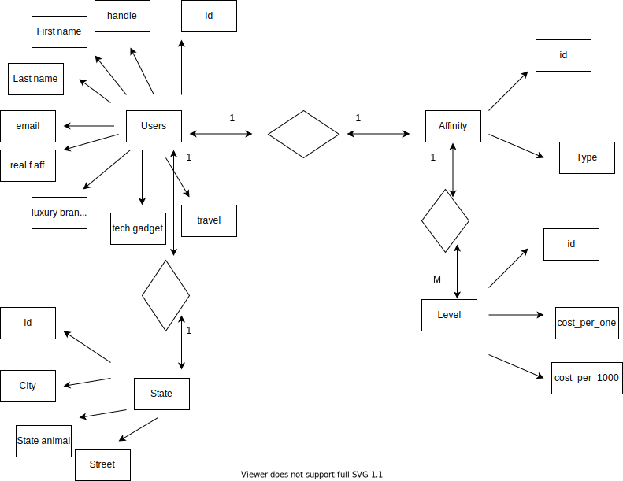

# Exam #1

The solutions content of this file below will be updated according to [the instructions](instructions/instructions.md).

## Solutions

The following sections contain a report on the solutions to each of the required components of this exam.

### Data munging

The code in the Python program, [solution.py](solution.py), contains the solutions to the **data munging** part of this exam.

### Spreadsheet analysis

The spreadsheet file, [users.xlsx](./data/users.xlsx), contains the solutions to the **spreadsheet analysis** part of this exam. In addition, the formulas used in that spreadsheet are indicated below:

- abide by [the instructions](./instructions/instructions.md#entering-respones-into-the-readme-file) for how to enter responses into this file correctly.
- **Make sure that all spreadsheet formulae you enter into this document work exactly as written.**

1. Total number of users of the social network

```
=ROWS(A2:A1001)
```

2. Number of users in each of the states in the Pacific sub-region, which includes Alaska, California, Hawaii, Oregon and Washington.

```
=COUNTIF(H2:H1001; N5)
=COUNTIF(H2:H1001; N6)
=COUNTIF(H2:H1001; N7)
=COUNTIF(H2:H1001; N8)
=COUNTIF(H2:H1001; N9)
```

3. Number of users in each of the given 5 cities of the USA: Nashville, Tennessee; San Diego, California; New York City, New York; Dallas, Texas; and Seattle, Washington.

```
=COUNTIFS(G2:G1001;N13;H2:H1001;O13)
=COUNTIFS(G2:G1001;N14;H2:H1001;O14)
=COUNTIFS(G2:G1001;N15;H2:H1001;O15)
=COUNTIFS(G2:G1001;N16;H2:H1001;O16)
=COUNTIFS(G2:G1001;N17;H2:H1001;O17)
```

4. The average affinity category IDs of all users in New York for each of the content types.

```
=AVERAGEIF(H2:H1001;O20;I2:I1001)
=AVERAGEIF(H2:H1001;O21;J2:J1001)
=AVERAGEIF(H2:H1001;O22;K2:K1001)
=AVERAGEIF(H2:H1001;O22;L2:L1001)
```

### SQL queries

This section shows the SQL queries that you determined solved each of the given problems.

- abide by [the instructions](./instructions/instructions.md#entering-respones-into-the-readme-file) for how to enter responses into this file correctly.
- **Make sure that all SQL commands you enter into this document work exactly as written, including semi-colons, where necessary.**

1. Write two SQL commands to create two tables named `users` and `affinity_categories` within the given database file.

```sql
CREATE TABLE users (
id INT,
handle TEXT,
first_name TEXT,
last_name TEXT,
email TEXT,
street TEXT,
city TEXT,
state TEXT,
state_animal TEXT,
real_food_affinity_category_id INT,
luxury_brand_affinity_category_id INT,
tech_gadget_affinity_category_id INT,
travel_affinity_category_id INT
);
```

```sql
CREATE TABLE affinity_categories (
id INT,
type TEXT,
level INT,
cost_per_impression INT,
cost_per_thousand INT
);
```

2. Import the data in the `users.csv` and `affinity_categories.csv` CSV files into these two tables.

```sql
.mode csv
.separator ","
.headers on
.import users.csv users
DELETE FROM users WHERE rowid in (select rowid FROM users LIMIT 1);
```

```sql
.mode csv
.separator ","
.headers on
.import affinity_categories.csv affinity_categories
DELETE FROM affinity_categories WHERE rowid in (select rowid FROM affinity_categories LIMIT 1);
```

3. Display the state name and the number of users in that state for each of the states for which we have users.

```sql
SELECT state, count(state) FROM users GROUP BY state;
```

4. Display the state name, the number of users in that state, and the average `travel_affinity_category_id` for each of the states for which we have users.

```sql
SELECT state, count(state), sum(travel_affinity_category_id)/count(state) FROM users GROUP BY state;
```

5. Display only the handles and last names of all users residing in Pittsburgh, Pennsylvania.

```sql
SELECT handle, last_name FROM users WHERE state = "Pennsylvania" and city = "Pittsburgh";
```

6. Display the email addresses of all users residing in Pittsburgh, Pennsylvania, along with the price the social network would charge an advertiser to show one advertisement to each of them, based on their `travel_affinity` level.

```sql
SELECT users.email, affinity_categories.cost_per_impression FROM users INNER JOIN affinity_categories ON users.travel_affinity_category_id = affinity_categories.id WHERE users.state = "Pennsylvania" and users.city = "Pittsburgh";
```

7. Display the amount the social network would charge an advertiser to show two advertisement to three thousand users with a `real_food_affinity` level of `0.75`.

```sql
SELECT type, (cost_per_thousand*2)*3 as cost_of_two_adv_to_3000users FROM affinity_categories WHERE type = "real_food_affinity" and level="0.75";
```

8. Show all the users for whom the `tech_gadget_affinity_category_id` field contains an invalid foreign key.

```sql
SELECT users.id,handle FROM users LEFT JOIN affinity_categories ON users.tech_gadget_affinity_category_id = affinity_categories.id WHERE users.tech_gadget_affinity_category_id IS "NULL";
```

9. Write an additional SQL query of your choice using SQL with this table; then describe the results

Output the users' first name, last name, and the amount the social network would charge an advertiser to show one advertisement to thousand users from Texas.

```sql
SELECT users.first_name, users.last_name, affinity_categories.cost_per_thousand FROM users INNER JOIN affinity_categories ON users.travel_affinity_category_id = affinity_categories.id WHERE users.state = "Texas"
```

### Normalization and Entity-relationship diagramming

This section contains responses to the questions on normalization and entity-relationship diagramming.

- abide by [the instructions](./instructions/instructions.md#entering-respones-into-the-readme-file) for how to enter responses into this file correctly.

1. Is the data in `users.csv` in fourth normal form?

```
Data in 'users.csv' do not meet the requirements of fourth normal form.
```

2. Explain why or why not the `users.csv` data meets 4NF.

```
'state_animal' field does not depend on the id of the user, it depends on the 'state' field which means that third normal form is violated because a non-key field is a fact about another non-key field. Thus, since requirements of third normal form is not satisfied, the data do not meet 4NF.
```

3. Is the data in `affinity_categories.csv` in fourth normal form?

```
Data in 'affinity_categories.csv' do not meet the requirements of fourth normal form.
```

4. Explain why or why not the `affinity_categories.csv` data meets 4NF.

```
'cost_per_impression' and 'cost_per_thousand' depends on the other non-key field 'level' as it happened with 'users' data. So, third normal form is violated because a non-key field is a fact about another non-key field, and consequently, the data do not meet 4NF. Also, repetition of data in 'type' field may cause data redundancy.
```

5. Use [draw.io](https://draw.io) to draw an Entity-Relationship Diagram showing a 4NF-compliant form of this data, including primary key field(s), relationship(s), and cardinality.


